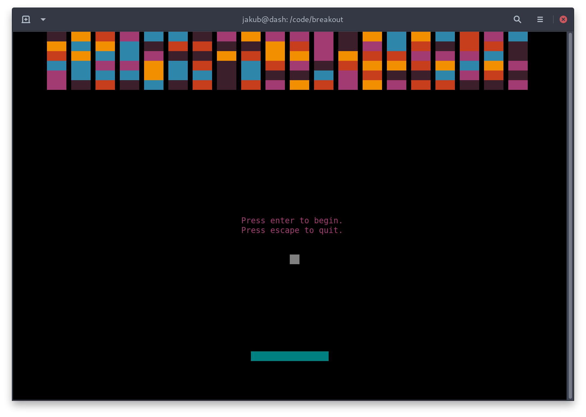

# Breakout

The popular game _Breakout_ implemented in Go and played in a terminal.



## How to play

1. Grab a pre-compiled binary from the releases, or build the executable from source.
1. Run the executable with `./breakout`
  - Run `./breakout -help` to see available options.
1. Press <kbd>Enter</kbd>
1. Move the platform with <kbd>←</kbd> and <kbd>→</kbd>.
1. Press <kbd>esc</kbd> to exit the game.

## Building

This project uses Go Modules. Dependencies are downloaded automatically.

```shell script
go build .
```
